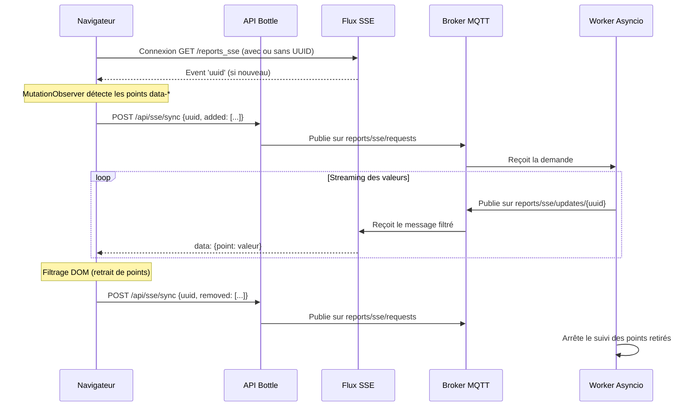

# Architecture SSE & MQTT — Mises à jour Dynamiques

Ce document décrit le système de mise à jour en temps réel des points de données dans l'interface `reports`, basé sur Server-Sent Events (SSE) et MQTT.

## 1. Vue d'ensemble

Le système permet de ne suivre et de ne mettre à jour que les points de données actuellement visibles à l'écran (dans le DOM). Il réduit la charge serveur en évitant le polling global et permet une réactivité quasi-instantanée grâce à MQTT.



## 2. Composants Client (Frontend)

### SSEPointManager (`templates/points_scripts.tpl`)
C'est le cœur de la logique client. Ses responsabilités sont :
- **Gestion de la connexion** : Établit la connexion `EventSource` et gère les reconnexions.
- **Identification** : Stocke l'UUID client dans le `localStorage` pour maintenir l'abonnement entre les rechargements de page.
- **Surveillance du DOM** : Utilise un `MutationObserver` pour détecter l'ajout ou le retrait d'éléments possédant les attributs `data-b`, `data-protocol`, `data-device`, `data-obj`.
- **Synchronisation** : Appelle l'API `/api/sse/sync` pour informer le backend des points à suivre ou à abandonner.
- **Dispatching** : Émet un événement global `sse:message` pour permettre à d'autres composants (ex: Graphiques) de réagir aux données.

## 3. Composants Serveur (Backend)

### Flux SSE (`src/web/stream.py`)
La route `/chantier/<id>/reports_sse` agit comme un proxy intelligent :
- Elle s'abonne aux topics MQTT globaux ET au topic spécifique du client (`reports/sse/updates/{uuid}`).
- Elle transforme les messages MQTT en flux SSE standard.
- Elle génère un UUID si le client n'en fournit pas.

### API de Synchronisation (`src/web/api.py`)
La route `POST /api/sse/sync` est un point d'entrée REST simple qui traduit les intentions du client en messages MQTT sur le topic `reports/sse/requests`.

## 4. Protocole MQTT

### Topics utilisés :
- **`reports/sse/requests`** : Demandes des clients (JSON contenant `uuid`, `added`, `removed`).
- **`reports/sse/updates`** : Mises à jour globales (ex: activité API).
- **`reports/sse/updates/{uuid}`** : Mises à jour ciblées pour un client spécifique.

### Format des messages d'update :
```json
{
  "hostname|protocol|device|obj": {
    "c": 150,
    "v": "22.5"
  }
}
```
*(c = count/nombre de relevés, v = value/dernière valeur)*

## 5. Worker de Traitement (`src/services/sse_worker.py`)

Ce service asynchrone (`asyncio` + `aiomqtt`) est responsable de la logique métier MQTT :
1. Il maintient en mémoire la liste des points souhaités par chaque `uuid`.
2. Il écoute les changements en base de données ou les publications des boîtiers.
3. Il route les valeurs uniquement vers les UUID qui les ont demandées.

## 6. Installation et Dépendances

Le système nécessite un broker MQTT local (Mosquitto par défaut).

Dépendances Python :
- `paho-mqtt` (utilisé par Bottle/uWSGI)
- `aiomqtt` (requis pour le worker asynchrone)
- `aiomysql` (recommandé pour le worker asynchrone)
